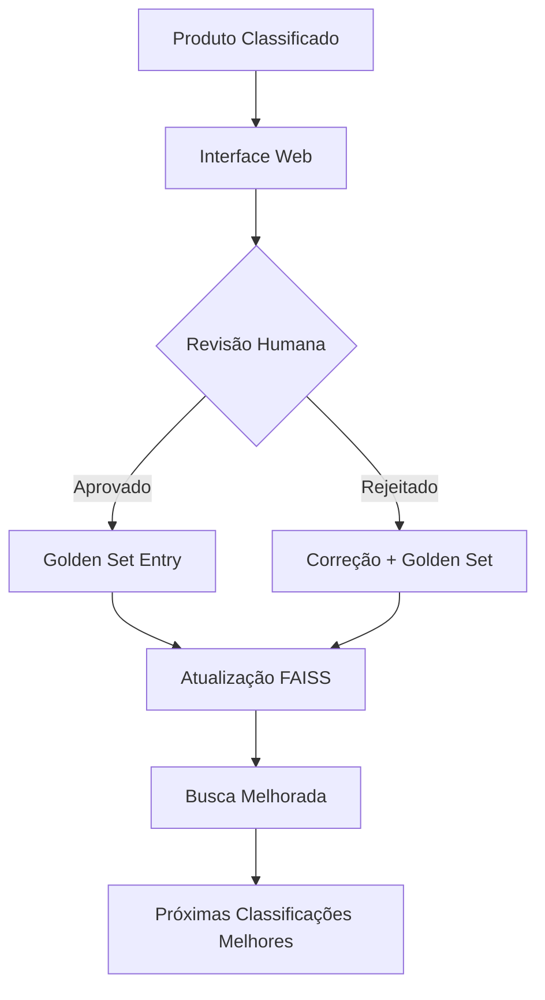

# 🌐 Guia Prático da Interface Web - Sistema de Revisão Humana

## 🚀 **Quick Start - Interface Web**

### 1. Inicialização Completa
```bash
# Passo 1: Criar estrutura do banco
python src/main.py setup-review --create-tables

# Passo 2: Importar classificações para revisão
python src/main.py setup-review --import-data

# Passo 3: Iniciar servidor web
python src/main.py setup-review --start-api
```

**URLs Disponíveis:**
- 🌐 **Interface Principal**: http://localhost:8000
- 📚 **Documentação Interativa**: http://localhost:8000/api/docs
- 🔧 **Health Check**: http://localhost:8000/api/health

## 📋 **Como Revisar Classificações**

### Método 1: Via Navegador (Documentação Interativa)

1. **Abra**: http://localhost:8000/api/docs
2. **Busque classificações pendentes**:
   - Endpoint: `GET /api/classificacoes/pendentes`
   - Clique em "Try it out"
   - Execute para ver produtos aguardando revisão

3. **Processe uma revisão**:
   - Endpoint: `POST /api/revisao/processar`
   - Clique em "Try it out" 
   - Cole o JSON de exemplo:
   ```json
   {
     "classificacao_id": 1,
     "ncm_final": "22021000",
     "cest_final": "03.002.00",
     "status_revisao": "aprovado",
     "comentarios": "Classificação correta para refrigerante de cola",
     "revisado_por": "especialista@empresa.com"
   }
   ```

### Método 2: Via Linha de Comando (curl)

```bash
# Listar classificações pendentes
curl -X GET "http://localhost:8000/api/classificacoes/pendentes?limite=5" \
     -H "Content-Type: application/json"

# Aprovar uma classificação
curl -X POST "http://localhost:8000/api/revisao/processar" \
     -H "Content-Type: application/json" \
     -d '{
       "classificacao_id": 1,
       "ncm_final": "22021000", 
       "cest_final": "03.002.00",
       "status_revisao": "aprovado",
       "comentarios": "Validado por especialista",
       "revisado_por": "user@empresa.com"
     }'

# Rejeitar uma classificação
curl -X POST "http://localhost:8000/api/revisao/processar" \
     -H "Content-Type: application/json" \
     -d '{
       "classificacao_id": 2,
       "ncm_final": "84733090",
       "cest_final": null,
       "status_revisao": "rejeitado",
       "comentarios": "NCM incorreto - produto não é eletrônico",
       "revisado_por": "user@empresa.com"
     }'
```

### Método 3: Via Python (Programático)

```python
import requests
import json

# Configuração
API_BASE = "http://localhost:8000/api"

# Listar pendentes
response = requests.get(f"{API_BASE}/classificacoes/pendentes?limite=10")
pendentes = response.json()

print(f"📋 {pendentes['total']} classificações pendentes")

# Processar primeira classificação
if pendentes['classificacoes']:
    primeira = pendentes['classificacoes'][0]
    
    revisao = {
        "classificacao_id": primeira['id'],
        "ncm_final": primeira['ncm_sugerido'],  # Aprovar sugestão
        "cest_final": primeira['cest_sugerido'],
        "status_revisao": "aprovado",
        "comentarios": "Aprovado automaticamente",
        "revisado_por": "sistema@empresa.com"
    }
    
    response = requests.post(f"{API_BASE}/revisao/processar", json=revisao)
    resultado = response.json()
    
    print(f"✅ Classificação {resultado['classificacao_id']} processada")
```

## 🏆 **Golden Set - Como as Aprovações Melhoram o Sistema**

### Fluxo Automático de Aprendizagem



### Verificar Impacto das Aprovações

```bash
# Ver status antes das revisões
python src/main.py golden-set --status

# Fazer algumas revisões via interface web...

# Ver status depois
python src/main.py golden-set --status

# Forçar atualização do Golden Set
python src/main.py golden-set --update
```

### Exemplo de Melhoria:

**Antes das Revisões:**
```
📊 Status do Golden Set:
   📈 Total de entradas: 50
   🆕 Novas (não retreinadas): 0
   📂 Índice Golden Set: ✅
```

**Depois de 20 Aprovações:**
```
📊 Status do Golden Set:
   📈 Total de entradas: 70
   🆕 Novas (não retreinadas): 20
   📂 Índice Golden Set: ✅
```

**Após Atualização:**
```
🔄 Atualizando Golden Set...
🎉 Atualização concluída!
   📊 Total de entradas: 70
   📂 Índice salvo em: data/knowledge_base/golden_set_index.faiss
```

## 📊 **Dashboard e Monitoramento**

### Ver Estatísticas em Tempo Real

```bash
# Via curl
curl "http://localhost:8000/api/dashboard/stats" | python -m json.tool
```

**Saída Esperada:**
```json
{
  "total_classificacoes": 1500,
  "pendentes": 145,
  "aprovadas": 1200,
  "rejeitadas": 155,
  "taxa_aprovacao": 0.80,
  "confianca_media": 0.82,
  "classificacoes_por_dia": {
    "2025-08-13": 250,
    "2025-08-12": 180,
    "2025-08-11": 320
  },
  "golden_set": {
    "total_entradas": 890,
    "ultima_atualizacao": "2025-08-13T08:30:00"
  }
}
```

### Monitoramento Contínuo

```python
# Script para monitoramento contínuo
import time
import requests
from datetime import datetime

def monitor_sistema():
    while True:
        try:
            # Buscar estatísticas
            stats = requests.get("http://localhost:8000/api/dashboard/stats").json()
            
            # Exibir resumo
            print(f"\n📊 {datetime.now().strftime('%H:%M:%S')}")
            print(f"   Pendentes: {stats['pendentes']}")
            print(f"   Taxa Aprovação: {stats['taxa_aprovacao']:.1%}")
            print(f"   Confiança Média: {stats['confianca_media']:.2f}")
            
            # Alerta se muitas pendentes
            if stats['pendentes'] > 200:
                print("🚨 ALERTA: Muitas classificações pendentes!")
            
        except Exception as e:
            print(f"❌ Erro no monitoramento: {e}")
        
        time.sleep(60)  # Verificar a cada minuto

# Executar: python monitor.py
if __name__ == "__main__":
    monitor_sistema()
```

## 🔧 **Casos de Uso Avançados**

### 1. Processamento em Lote de Revisões

```python
# Script para processar múltiplas revisões
import requests

API_BASE = "http://localhost:8000/api"

# Buscar todas as pendentes
pendentes = requests.get(f"{API_BASE}/classificacoes/pendentes?limite=100").json()

aprovacoes_automaticas = 0
for classificacao in pendentes['classificacoes']:
    # Aprovar automaticamente se confiança alta
    if classificacao['confianca_original'] > 0.9:
        revisao = {
            "classificacao_id": classificacao['id'],
            "ncm_final": classificacao['ncm_sugerido'],
            "cest_final": classificacao['cest_sugerido'], 
            "status_revisao": "aprovado",
            "comentarios": "Auto-aprovado - alta confiança",
            "revisado_por": "sistema_auto@empresa.com"
        }
        
        requests.post(f"{API_BASE}/revisao/processar", json=revisao)
        aprovacoes_automaticas += 1

print(f"✅ {aprovacoes_automaticas} classificações auto-aprovadas")
```

### 2. Integração com Sistema Externo

```python
# Integrar com ERP/Sistema de Produtos
class IntegradorERP:
    def __init__(self, api_base_url):
        self.api_base = api_base_url
    
    def sincronizar_produtos(self):
        # 1. Buscar produtos do ERP
        produtos_erp = self.buscar_produtos_nao_classificados()
        
        # 2. Classificar via sistema agêntico
        for produto in produtos_erp:
            resultado = self.classificar_produto(produto)
            
            # 3. Se confiança baixa, enviar para revisão humana
            if resultado['confianca'] < 0.8:
                self.enviar_para_revisao(produto, resultado)
            else:
                # 4. Se confiança alta, aplicar automaticamente
                self.aplicar_classificacao_erp(produto, resultado)
    
    def processar_revisoes_aprovadas(self):
        # Buscar revisões aprovadas e aplicar no ERP
        aprovadas = requests.get(f"{self.api_base}/classificacoes/aprovadas").json()
        
        for classificacao in aprovadas:
            self.aplicar_classificacao_erp(
                classificacao['codigo_produto'],
                {
                    'ncm': classificacao['ncm_final'],
                    'cest': classificacao['cest_final']
                }
            )
```

## 🎯 **Fluxo Completo de Produção**

### Rotina Diária Recomendada

```bash
#!/bin/bash
# rotina_diaria.sh

echo "🌅 Iniciando rotina diária de classificação fiscal"

# 1. Classificar novos produtos
echo "📦 Classificando produtos novos..."
python src/main.py classify --from-db --limit 1000

# 2. Verificar quantas precisam de revisão
echo "📋 Verificando pendências..."
curl -s "http://localhost:8000/api/dashboard/stats" | \
    python -c "import sys, json; data=json.load(sys.stdin); print(f'Pendentes: {data[\"pendentes\"]}')"

# 3. Processar aprovações automáticas (alta confiança)
echo "✅ Processando aprovações automáticas..."
python scripts/aprovacao_automatica.py

# 4. Atualizar Golden Set se necessário
echo "🏆 Atualizando Golden Set..."
python src/main.py golden-set --update

# 5. Gerar relatório diário
echo "📊 Gerando relatório..."
python scripts/relatorio_diario.py

echo "🎉 Rotina diária concluída!"
```

---

## 🎉 **Resultado Final**

Com esta implementação, você tem um **sistema completo de revisão humana e aprendizagem contínua** que:

1. **🌐 Interface Web Funcional** para revisão de classificações
2. **🏆 Golden Set Automático** que melhora o sistema com cada aprovação  
3. **📊 Dashboard em Tempo Real** com métricas de qualidade
4. **🔄 Aprendizagem Contínua** que torna o sistema mais preciso com o tempo
5. **🔧 APIs Flexíveis** para integração com sistemas externos

**Status: ✅ SISTEMA PRODUTIVO E OPERACIONAL** 🚀
